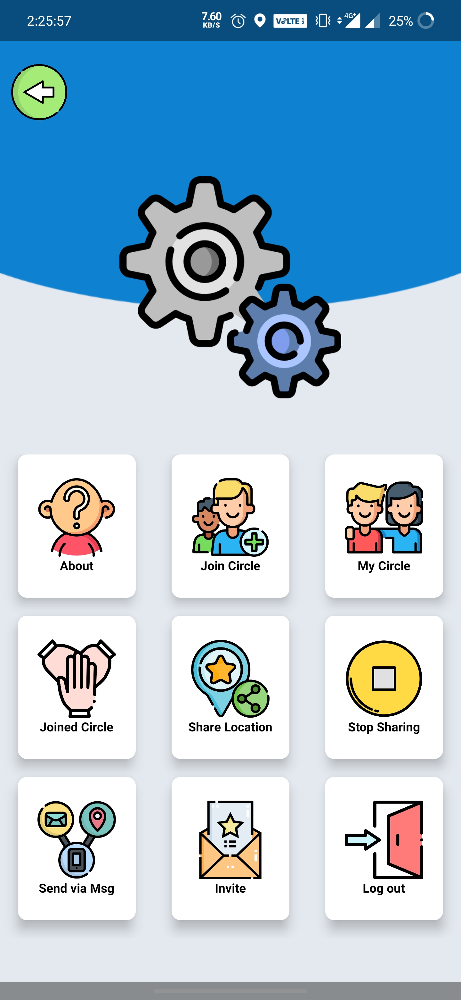
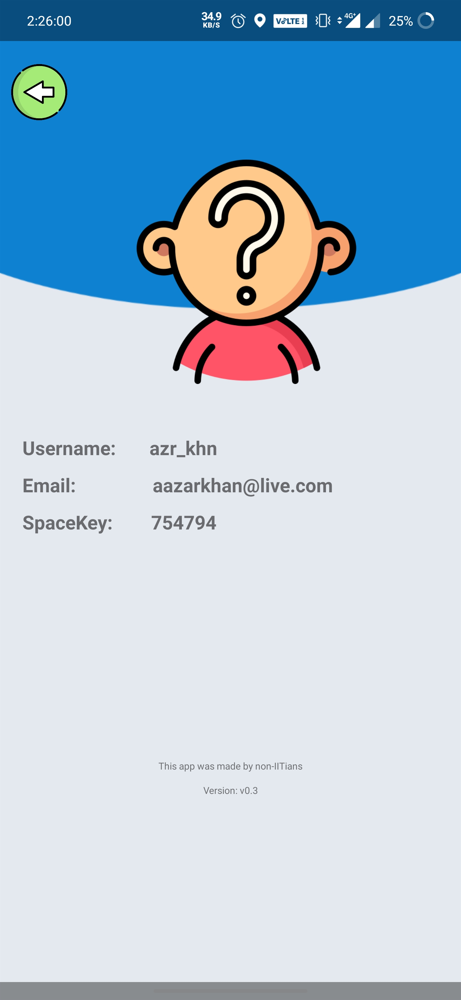
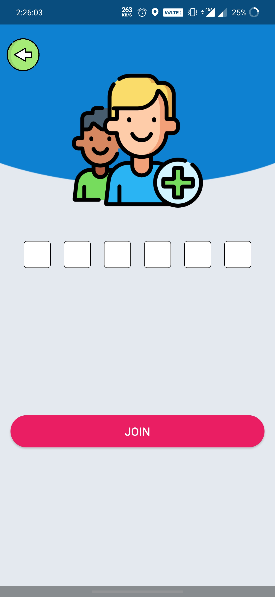
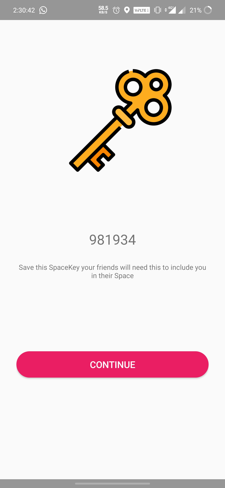

# TheSpaceApp
The Space App is an Android application which helps people pratice social-distancing in the COVID-19 outbreak.The app uses the Google Maps API to determin distance between two users and Google Firebase to read and write data their distance, latitude, longitude, and status from cloud. With the help of multi-threadin the app refresh itself automatically every minute. This app helps user keep an eye on the head count within user's 1.5m radius.

    

    

    

